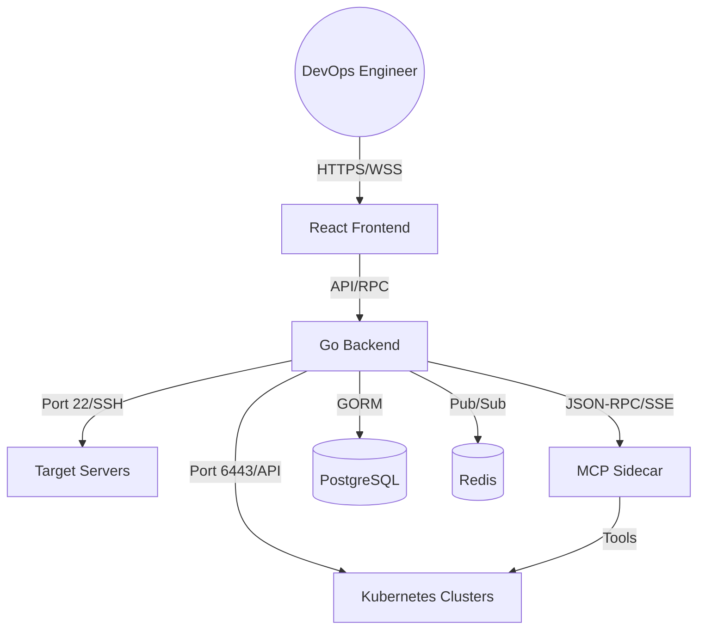

<div align="center">


# InfraEye

**Observing the Unseen • Healing the Broken**

[](https://golang.org)
[](https://reactjs.org)
[](https://typescriptlang.org)
[](https://docker.com)
[](LICENSE)

**InfraEye** is an enterprise-grade, agentless observability platform designed for modern DevOps teams. It provides a unified "Command Center" for your entire infrastructure—from bare-metal Linux servers to complex Kubernetes clusters—featuring real-time telemetry, AI-driven diagnostics, and a proactive self-healing engine.

[Explore Documentation](documentation.md) • [Report Bug](https://github.com/mnshchtri/infra-eye/issues) • [Request Feature](https://github.com/mnshchtri/infra-eye/issues)

</div>

---

## Vision

In an era of microservices and ephemeral infrastructure, observability shouldn't be expensive or complex. InfraEye bridges the gap between raw metrics and actionable intelligence by providing a high-fidelity, real-time cockpit that doesn't just tell you what's wrong, but helps you fix it—automatically.

## Key Modules

| Module                             | Description                                                                            | status           |
| :--------------------------------- | :------------------------------------------------------------------------------------- | :--------------- |
| **Infrastructure Navigator** | Unified view of Linux servers with real-time CPU, Mem, Disk & Network telemetry.       | `Production`   |
| **Kubernetes 'Lens'**        | Advanced resource explorer for Pods, Deployments, and Events with 1-click diagnostics. | `Production`   |
| **Netra AI Assistant**       | LLM-powered (GPT-4o/Gemini) infrastructure consulting and log analysis.                | `Beta`         |
| **Self-Healing Engine**      | XML-defined alert rules that trigger automated SSH remediation commands.               | `Production`   |
| **MCP Sidecar**              | Model Context Protocol integration for AI-driven cluster troubleshooting.              | `Experimental` |
| **SSH Terminal**             | Full browser-based `xterm.js` terminal over secure SSH tunnels.                      | `Production`   |

---

## Architecture

InfraEye uses a **Distributed Bridge** architecture. Instead of installing heavy agents on every node, our Go-backend establishes secure, lightweight SSH connections to gather metrics and stream logs.



---

## Quick Start Deployment (Production)

InfraEye can be deployed fully containerized. We deliver automated installer scripts for both native Kubernetes (recommended) and Docker Compose. Images are pulled directly from `ghcr.io/mnshchtri/infra-eye`.

### Option A: Kubernetes (Recommended)
This deploys InfraEye, Postgres, Redis, and the MCP sidecar into the `infra-eye` namespace via Kustomize. It bypasses Docker networking conflicts by using a direct `NodePort`.

```bash
# Ensure KUBECONFIG is set (e.g., export KUBECONFIG=/etc/rancher/k3s/k3s.yaml)
curl -fsSL https://raw.githubusercontent.com/mnshchtri/infra-eye/main/install-k8s.sh | bash
```

### Option B: Docker Compose
If you prefer a pure Docker setup, this isolates the stack and manages the reverse proxy bindings.

```bash
curl -fsSL https://raw.githubusercontent.com/mnshchtri/infra-eye/main/install.sh | bash
```

### Accessing the Platform

After installation, the scripts will output the exact URL you need to access (e.g., `http://<node-ip>:30080` for K8s or `http://<node-ip>:8080` for Docker).

**Default Login:**
- **Username:** `admin`
- **Password:** `infra123`

*(⚠ Change this password immediately after the first login!)*

---

## Developer Setup (Hybrid Mode)

For active development, we recommend running databases in Docker and the app natively.

```bash
# 1. Start core infrastructure
make infra

# 2. Install dependencies
make backend-install
make frontend-install

# 3. Run Development Servers
# Terminal 1: Backend
make backend

# Terminal 2: Frontend
make frontend
```

---

## Upcoming Features (Roadmap)

We are constantly evolving. Here's what's currently in the pipeline:

- [ ] **OIDC / SSO Integration**: Support for Google, GitHub, and Okta authentication.
- [ ] **Infrastructure-as-Code Sync**: Sync your server list and alert rules directly from a Git repo.
- [ ] **Terraform Bridge**: Visualize and drift-detect Terraform-managed resources.
- [ ] **Metric Persistence**: Long-term data retention using Prometheus/VictoriaMetrics.
- [ ] **Mobile Command Center**: A dedicated PWA optimized for "on-call" emergency status checks.
- [ ] **Dynamic Alert Builder**: A visual drag-and-drop builder for "Self-Healing" conditions.

---

## Contributing

We ❤️ contributions! Whether you're fixing a bug, adding a new feature, or improving documentation, your help is appreciated.

1. **Fork** the repository.
2. **Create** a feature branch (`git checkout -b feature/amazing-feature`).
3. **Commit** your changes (`git commit -m 'Add amazing feature'`).
4. **Push** to the branch (`git push origin feature/amazing-feature`).
5. **Open** a Pull Request.

**How you can help right now:**

- Help us improve the **Kubernetes Resource Explorer** with more resource types (CRDs, NetworkPolicies).
- Add support for **different OS collectors** (BSD, Windows).
- Improve the **AI Assistant's prompt engineering** for better infrastructure diagnostics.

---

<div align="center">

</div>
